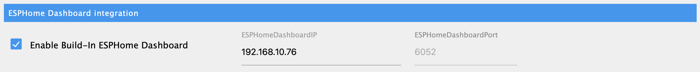

# Adapter-Konfiguration

## ESPHome Dashboard

Hier können Sie das von ioBroker gehostete ESPHome Dashboard aktivieren / deaktivieren. Eine separate Installation von ESPHome ist nicht erforderlich :-)

* Aktivieren / Deaktivieren des ESPHome Dashboards
* ESPHome Dashboard IP (für Admin-Tabs, optional)

### Admin-Registerkarte

- Wenn das tab nicht sichtbar ist, aktivieren Sie das ESPHome-Tabb in der oberen linken Ecke!
- IP-Adresse muss in den Adaptereinstellungen angegeben werden

## Hinzufügen von Geräten
ESPHome-Geräte werden automatisch erkannt. Falls nicht, können Sie die Schaltfläche ADD Device verwenden

### Discovery-Einstellungen
* Wiederverbindungsintervall
  Zeit in Sekunden, die der Adapter versucht, die Geräte wieder zu verbinden, wenn die Verbindung unterbrochen wurde

* Standard-Passwort  
  Passwort, das für die automatische Erkennung verwendet wird

* Automatische Erkennung aktiviert
  Verwendet MDNS, um nach Geräten zu suchen, wenn der Adapter hochfährt und neue Geräte dem Netzwerk beitreten.
  Wenn die automatische Erkennung fehlschlägt, können Sie das Gerät manuell über die Schaltfläche ADD DEVICE hinzufügen.

### Geräteübersicht
Der Online-Status zeigt an, ob eine aktive Verbindung zu dem/den Gerät(en) besteht.
Eventuelle IP- oder Passwort-Änderungen können mit dem Bleistift vorgenommen werden,

### Geräte manuell hinzufügen
Mit der Schaltfläche ADD device wird ein Popup aktiviert,
wdamit kann durch Eingabe der IP-Adresse und des Passwortes eine Verbindung mit dem Gerät aufgebaut werden.

