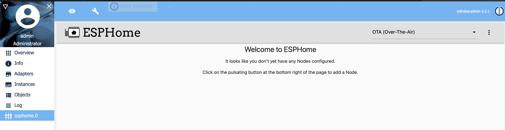

# Mein erstes Gerät

Wenn richtig konfiguriert, siehe Abschnitt [Adapterkonfiguration](./03.adapterConfig.md), ist das ESPHome Dashboard verfügbar.



## Neues Gerät hinzufügen

1) Geben Sie Ihre Grundeinstellungen an  
   
   ::: tip Erstellte Konfigurationsdateien (>device<.yaml) werden gespeichert unter
   ```/opt/iobroker/node_modules/iobroker.esphome/config/>device<.yaml```
   :::

2) Klicken Sie auf Kompilieren, um Ihr Binary zu erstellen  
   
   

3) Laden Sie das h-Binary herunter und flashen Sie es auf Ihr ESP-Gerät

   
   
Für Unterstützung bei der Einrichtung der yaml oder der Verbindung wenden Sie sich bitte an die ESPHome-Community, wenn alles gut gegangen ist, wird das Gerät als verbunden angezeigt und Sie können mit der Einrichtung fortfahren


   
::: tip Brauchen Sie etwas Inspiration?
Werfen Sie einen Blick auf meine [Beispiel konfigurationen](./05.configExample.md) oder sehen Sie sich [ESPHome.io](https://esphome.io)an
:::