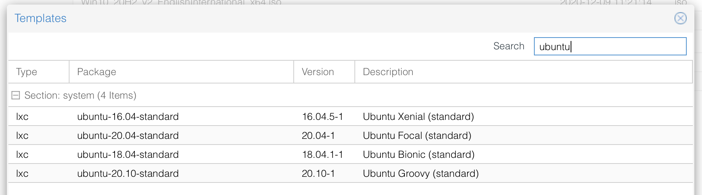
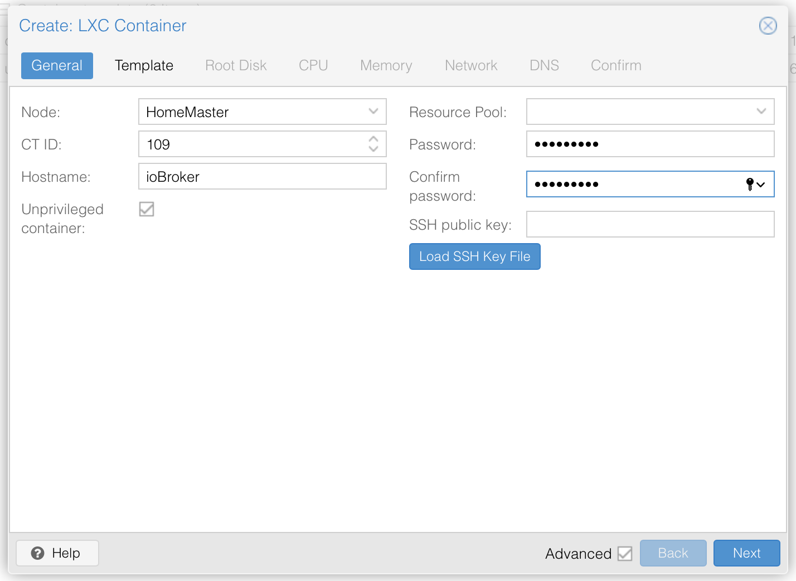
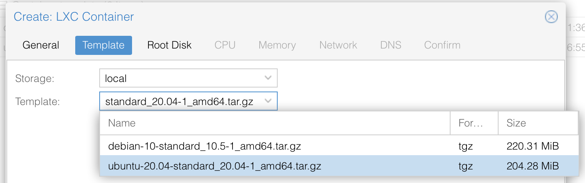
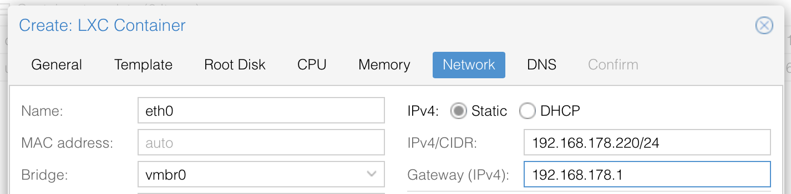

# Proxmox (LXC)

Proxmox VE ist eine Open-Source-Server-Management-Plattform für Ihre Unternehmensvirtualisierung. Sie integriert KVM-Hypervisor und LXC, softwaredefinierte Speicher- und Netzwerkfunktionen auf einer einzigen Plattform. Mit der integrierten webbasierten Benutzeroberfläche können Sie VMs und Container, hochverfügbare Cluster oder die integrierten Disaster-Recovery-Tools einfach verwalten.

## Was ist LXC?
Container sind eine leichtgewichtige Alternative zu vollständig virtualisierten Maschinen (VMs). Sie verwenden den Kernel des Host-Systems, auf dem sie laufen, anstatt ein vollständiges Betriebssystem (OS) zu emulieren. Das bedeutet, dass Container direkt auf Ressourcen des Hostsystems zugreifen können.  
Die Laufzeitkosten für Container sind gering, in der Regel vernachlässigbar. Es gibt jedoch einige Nachteile, die berücksichtigt werden müssen:

* In Proxmox Containern können nur Linux-Distributionen ausgeführt werden. Es ist nicht möglich, andere Betriebssysteme wie z.B. FreeBSD oder Microsoft Windows innerhalb eines Containers zu betreiben.
* Aus Sicherheitsgründen muss der Zugriff auf Host-Ressourcen eingeschränkt werden. Daher laufen Container in eigenen, separaten Namespaces. Außerdem sind einige Syscalls (Userspace-Anfragen an den Linux-Kernel) innerhalb von Containern nicht erlaubt.

## Grundlegende Einrichtung

## 1 LXC-Template herunterladen
Zunächst benötigen wir ein LXC-Template, es gibt verschiedene Distributionen (Ubuntu, debian etc) zum Download
1) Wählen Sie auf der linken Seite Ihren Speicherbereich 
2) Wählen Sie , ein Popup-Fenster wird geöffnet
3) Wählen Sie die Linux-Distribution Ihrer Wahl, ich empfehle die neueste LTS von Ubuntu oder Debian  
   
4) Klicken Sie auf den Download-Button, die Vorlage wird auf Ihr System heruntergeladen

### 2 LXC-Container erstellen
1) Erstellen Sie einen neuen LXC-Container 
2) Die folgenden Haupteinstellungen sind erforderlich
   * ID : Proxmox wählt automatisch die erste verfügbare ID, Sie können diese bei Bedarf ändern
   * Hostname : Name Ihres Systems, wird auch der NetBios-Name sein !
   * Passwort : Passwort des Root-Accounts  
     
3) Wählen Sie die gewünschte Vorlage aus, die Sie verwenden möchten
   
4) Definieren Sie die Speichergröße Ihrer Festplatte (ich empfehle 10 GB für eine reine ioBroker-Einrichtung)
   
5) Cores definieren (1 ist ausreichend, da NodeJS nicht multitaskingfähig ist)
   
6) Definieren Sie den Speicher (ich empfehle 2048 für kleine und 4096 für große Systeme)
   
7) Geben Sie Ihre Netzwerkeinstellungen an, dies kann per DHCP oder manuell erfolgen, bitte beachten Sie das /24 bei manueller Eingabe !
   
8) Sie können die DNS-Server leer lassen, um den Standard zu verwenden und die Schritte zur Erstellung des Containers abschließen

## 3 USB-Geräte einbinden
Um sicherzustellen, dass USB-Geräte (wie z.B. Zigbee-Sticks) innerhalb des LXC verwendet werden können, müssen wir:
1) Sicherstellen, dass das Gerät immer in das Verzeichnis sae gemountet wird
2) Sicherstellen, dass das Mount direkt beschreibbar ist
3) Die Ports an den LXC-Container weiterleiten

Um 1 & 2 zu erreichen, werden wir udev-rules verwenden, um den USB-Geräten nicht veränderbare TTY-Namen zuzuweisen, indem wir symbolische Links von physischen Geräten erstellen.  
Als letzten Schritt modifizieren wir die Container-Konfiguration, um das Einhängen des symbolischen Links des Hosts in den Container zu erreichen.

### 3.1 Erstellen von symbolischen Links auf physikalische Geräte
1) Identifizieren Sie den Hersteller und die Produkt-ID. Nehmen Sie an, dass das Gerät derzeit auf ```/dev/ttyACM0`` gemountet ist und verwenden Sie den folgenden Befehl
```
udevadm info -a -p $(udevadm info -q path -n /dev/ttyACM0) | grep "ATTRS{idVendor}" && udevadm info -a -p $(udevadm info -q path -n /dev/ttyACM0) | grep "ATTRS{idProduct}"
```  
*Ersetzen Sie ```/dev/ttyACM0`` durch den richtigen Einhängepunkt, falls nötig

2) Sie sollten etwa so etwas sehen, wir brauchen immer die Werte oben!
```
ATTRS{idVendor}=="0451"
ATTRS{idVendor}=="1d6b"
ATTRS{idProduct}=="16c8"
ATTRS{idProduct}=="0002"
```

3) Erstellen Sie eine neue udev-Regel ```nano /etc/udev/rules.d/49-custom.rules`` und tragen Sie folgende Zeilen ein
```
KERNEL=="ttyACM[0-9]*", SUBSYSTEM=="tty", ATTRS{idVendor}=="0451", ATTRS{idProduct}=="16c8", SYMLINK="ttyZigbee"
```
Ersetzen Sie die folgenden Elemente durch die zuvor abgerufenen Werte und wählen Sie einen SYMLINK
- idVendor ```Rückgewonnen in Schritt 2``
- idProduct ```Abgerufen in Schritt 2``
- SYMLINK ```Der gewünschte Einhängepunkt, normalerweise ttyACM0``

### 3.2 Sicherstellen der korrekten ACL auf dem gemounteten Laufwerk
1) Öffnen Sie die zuvor erstellte udev-Regel
   ```nano /etc/udev/rules.d/49-custom.rules```
2) Fügen Sie die folgende Zeile hinzu, um sicherzustellen, dass die ACL auf 0666 gesetzt ist
    ```
    SUBSYSTEMS=="usb", ATTRS{idVendor}=="0451", ATTRS{idProduct}=="16c8", GROUP="users", MODE="0666"
   ```
Stellen Sie sicher, dass **idVendor** und **idProduct** korrekt angegeben sind (siehe Schritt 3.1, vorheriger Abschnitt). Laden Sie die Konfiguration neu und prüfen Sie, ob das neue Gerät vorhanden ist:
   ```
   udevadm control --reload
   ls -l /dev/
   ```
falls nicht: einen Neustart von Proxmox versuchen

### 4 Gerät in LXC einbinden
Mounten Sie den neu erstellten Symlink in Ihren lxc dev Container
1) Ermitteln Sie die ACL-Gruppen-ID des erstellten Symlinks
```
ls -l /dev/ttyZigbee
   
lrwxrwxrwx 1 root root 7 Mar 10 13:40 /dev/ttyZigbee -> ttyACM0
```

in meinem Fall ist die ID **7**, siehe die Zahl zwischen Benutzer und Datum

2) Öffnen Sie die LXC-Konfigurationsdatei
```
nano /etc/pve/lxc/XXX.conf
```
4) Fügen Sie die folgenden Zeilen ein, ersetzen Sie **7** durch die Zahl aus Schritt 1 und stellen Sie sicher, dass das Symlink-Verzeichnis korrekt ist
```
lxc.cgroup.devices.allow: c 7:* rwm
lxc.mount.entry: /dev/ttyZigbee dev/ttyZigbee none bind,optional,create=file
```

## NodeJS
ioBroker ist als NodeJS-Projekt gebaut und benötigt das NodeJS-Framework (nicht Teil von ioBroker), um lauffähig zu sein.  
Node.js ist eine quelloffene, plattformübergreifende Back-End-JavaScript-Laufzeitumgebung, die auf der V8-Engine läuft und JavaScript-Code außerhalb eines Webbrowsers ausführt.

### NodeJS installieren
```
curl -sL https://deb.nodesource.com/setup_14.x | sudo -E bash -
sudo apt install -y nodejs
sudo reboot
```

Wenn Sie die Fehlermeldung ```bash: curl: command not found`` erhalten, können Sie curl installieren, indem Sie ```apt install curl`` eingeben