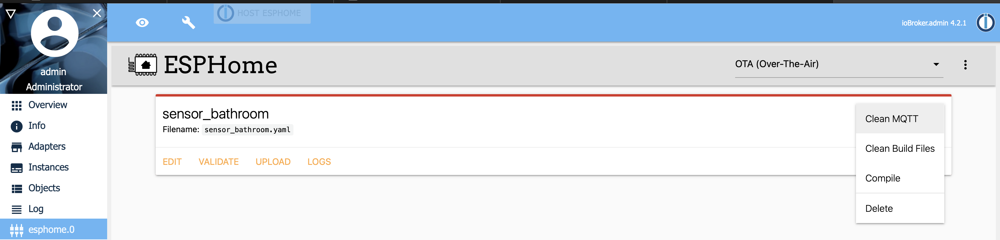

# Mein erstes Gerät

Wenn richtig konfiguriert, siehe Abschnitt [Adapterkonfiguration](./03.adapterConfig.md), ist das ESPHome Dashboard verfügbar.

## Neues Gerät hinzufügen

1) Geben Sie Ihre Grundeinstellungen an

   
2) Klicken Sie auf Kompilieren, um Ihr Binary zu erstellen

   

   

3) Laden Sie das h-Binary herunter und flashen Sie es auf Ihr ESP-Gerät

   
   
Für Unterstützung bei der Einrichtung der yaml oder der Verbindung wenden Sie sich bitte an die ESPHome-Community, wenn alles gut gegangen ist, wird das Gerät als verbunden angezeigt und Sie können mit der Einrichtung fortfahren

Schauen Sie sich meine [Beispielkonfiguration](./05.configExample.md) an oder schauen Sie unter [ESPHome.io](https://esphome.io)