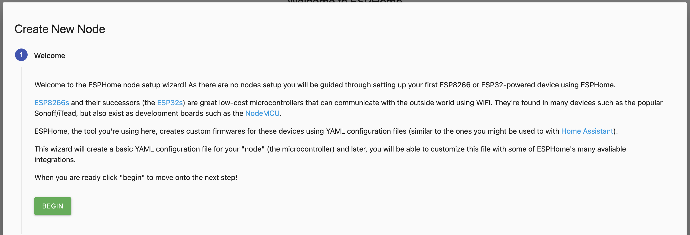

# My First Device

If proper configured, see section [Adapter configuration](./03.adapterConfig.md), ESPHome Dashboard will be available.


## Add new device

1) Provide your basic settings  
   
   ::: tip Created configuration (>device<.yaml) files will be stored at
   ```/opt/iobroker/node_modules/iobroker.esphome/config/>device<.yaml```
   ::: 
2) Klick on compile  to create your binary  
   
   
   
3) Download the binary and flash it to your ESP-Device  
   
   
For support setting up the yaml or connection issue please sse the ESPHome community, if all went well the device will be shown connected and you can continue your setup 


   
::: tip Need some inspiration ?
Have a look at my [Example Configuration](./05.configExample.md) or see [ESPHome.io](https://esphome.io)
:::