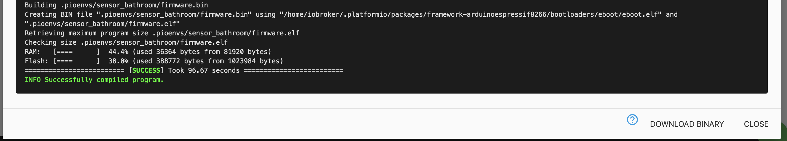

# Tasmota / ESPEasy migraion

Migrating from previous Sonoff Tasmota or ESPEasy setups is very easy. You just need to have ESPHome create a binary for you and then upload that in the web interface.

## Download Binary
::: tip
First follow the guides [My First Device](./04.myFirstDevice.md) and create a configuration file. Then, generate and download the binary:
:::


## Upload Binary
To upload the binary, navigate to the Tasmota/ESPEasy web interface

## Tasmota

Enter the "Firmware Upgrade" section.


In the "Upgrade by file upload" section, choose the binary you previously downloaded


If everything succeeds, you will see an "Upload Successful" message and ESPHome
will connect to the WiFi network configured in your .yaml file. 🎉


::: warning
When using the `esp8266_pwm output </components/output/esp8266_pwm>` platform and
switching from Tasmota, you need to power-cycle the device once. After that
the dimming functionality will work as usual and no more power cycles are required.
:::

::: tip
If you are using Tasmota 8+ and get an error after uploading the firmware, go to the console and type ```SetOption78 1```, then restart the device and try the firmware again.
::: 

### ESPEasy

Enter the "Tools " section.


Press "Load" under Firmware, then select the binary you previously downloaded and upload
the binary. If everything succeeds, you should now have ESPHome on your node 🎉.

::: tip
with ESPHome, you in most cases won't need to worry about the available flash size, as
the binary only ever includes the code that you are actually using.
:::