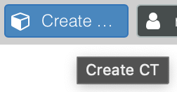
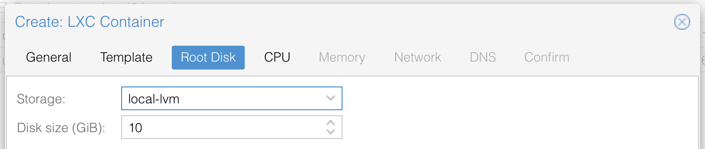
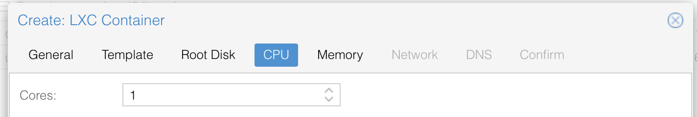
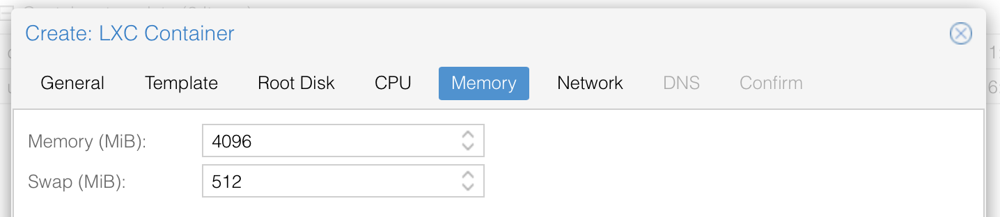

# Proxmox (LXC)

Proxmox VE is an open-source server management platform for your enterprise virtualization. It tightly integrates KVM hypervisor and LXC, software-defined storage, and networking functionality on a single platform. With the integrated web-based user interface you can easily manage VMs and containers, highly available clusters, or the integrated disaster recovery tools with ease.

## What is LXC ?
Containers are a lightweight alternative to fully virtualized machines (VMs). They use the kernel of the host system that they run on, instead of emulating a full operating system (OS). This means that containers can access resources on the host system directly.  
The runtime costs for containers is low, usually negligible. However, there are some drawbacks that need be considered:

* Only Linux distributions can be run in Proxmox Containers. It is not possible to run other operating systems like, for example, FreeBSD or Microsoft Windows inside a container.  
* For security reasons, access to host resources needs to be restricted. Therefore, containers run in their own separate namespaces. Additionally some syscalls (user space requests to the Linux kernel) are not allowed within containers.

## Basic setup

### 1 Download LXC-Template
First we need  an LXC-Template, there are several distributions (Ubuntu, debian etc)  available to download
1) Select your storage area on the left 

2) Select , a popup box will open
3) Choose the linux distribution of your choice, i advice the latest LTS of Ubuntu or Debian  
   
4) Hit the download button, the template will be downloaded to your system

### 2 Create LXC container
1) Create new LXC-Container 
2) The following main settings are required
    * ID : Proxmox will automatically choose the firsst available, you can change this if wanted
    * Hostname : Name of your system, will also be the NetBios name !
    * Password : Password of the root account  
             
3) Choose your preferred template to use
   
4) Define storage size of you disk (I recommend 10 GB for an ioBroker only setup)
   
5) Define cores (1 is sufficient as NodeJS is not multitasking)
   
6) Define memory (I recommend 2048 for small and 4096 for large system)
   
7) Provide your network settings, this can be handled by DHCP or manually, please note the /24 for manual input !
   
8) You can leave the DNS servers empty to use  the default and finish you steps to create the container

## 3 Mount USB-Devices
To ensure USB-Devices (like zigbee stick) can be used within the LXC, we need to:   
1) Ensure the device is always mounted into the sae directory  
2) Ensure the mount directly is writable  
3) Forward the ports to the LXC container  

To accomplish 1 & 2 we will use udev-rules to assign un-mutable TTY names to USB devices by creating symbolic links of physical devices.  
As last step we modify the container configuration to accomplish mount the host symbolic link into the container.

### 3.1 Creating symbolic links of physical devices
1) Identify the vendor and product id, assuming the device is currently mounted to ```/dev/ttyACM0``` use the following commmmand  
```
udevadm info -a -p $(udevadm info -q path -n /dev/ttyACM0) | grep "ATTRS{idVendor}"  && udevadm info -a -p $(udevadm info -q path -n /dev/ttyACM0) | grep "ATTRS{idProduct}"
```  
*Replace ```/dev/ttyACM0``` wih the proper mount point if needed  

2) You should see something like this, we always need the values at the top!  
```
ATTRS{idVendor}=="0451"
ATTRS{idVendor}=="1d6b"
ATTRS{idProduct}=="16c8"
ATTRS{idProduct}=="0002"
```

3) create new udev-rule ```nano /etc/udev/rules.d/49-custom.rules``` and enter the following lines
```
KERNEL=="ttyACM[0-9]*", SUBSYSTEM=="tty", ATTRS{idVendor}=="0451", ATTRS{idProduct}=="16c8", SYMLINK="ttyZigbee"
```
Replace the following items with the previous retrieved values and choose a SYMLINK
- idVendor ```Retrieved in step 2```
- idProduct ```Retrieved in step 2```
- SYMLINK  ```The wanted mounting point, usually ttyACM0```

### 3.2 Ensure correct ACL on mounted drive
1) Open the previous created udev-rule
   ```nano /etc/udev/rules.d/49-custom.rules```
2) Add the following line to ensure the ACL is set to 0666
    ```
    SUBSYSTEMS=="usb", ATTRS{idVendor}=="0451", ATTRS{idProduct}=="16c8", GROUP="users", MODE="0666"
   ```
Ensure **idVendor** and **idProduct** is provided correctly (See step 3.1, previous section). Reload the configuration and check if the new device is present:  
```
udevadm control --reload
ls -l /dev/
```
   if not: try a reboot of Proxmox
    
### 4 Mount device into LXC 
 Mount the new created symlink into your lxc dev container
    1) Get the ACL group ID of created symlink 
```
ls -l /dev/ttyZigbee
   
lrwxrwxrwx 1 root root 7 Mar 10 13:40 /dev/ttyZigbee -> ttyACM0
```
    
in my case the ID is **7**, see the number between user and date  

   2) Open the LXC configuration file 
```
nano /etc/pve/lxc/XXX.conf
```
   4) add the following lines, replace **7** with the number in step 1 and ensure proper symlink directory
```
lxc.cgroup.devices.allow: c 7:* rwm
lxc.mount.entry: /dev/ttyZigbee dev/ttyZigbee none bind,optional,create=file
```

## NodeJS
ioBroker is build as NodeJS project and needs the NodeJS framework (not part of ioBroker) to be able to run.  
Node.js is an open-source, cross-platform, back-end JavaScript runtime environment that runs on the V8 engine and executes JavaScript code outside a web browser.

### Install NodeJS
```
curl -sL https://deb.nodesource.com/setup_14.x | sudo -E bash -
sudo apt install -y nodejs
sudo reboot
```

If you receive an error message  ```bash: curl: command not found```  you can install curl by entering ```apt install curl```
