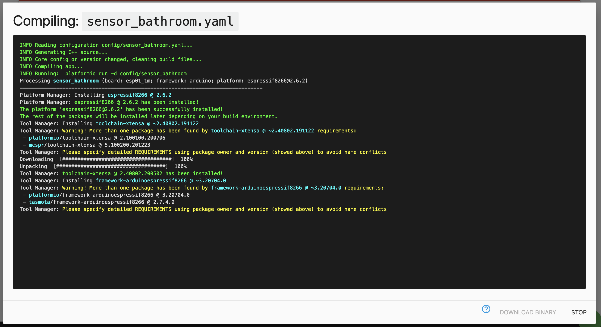

# My  First Device

If proper configured, see section [Adapter configuration](./03.adapterConfig.md), ESPHome Dashboard will be available.

## Add new device

1) Provide your basic settings 
   
   
2) Klick on compile  to create your binary

   
   
3) Download h binary and flash it to your ESP-Device
   
   
For support setting up the yaml or connection isse please sse the ESPHome community, if all went well the device will be shown connected and you can continue your setup 

   
Have a look at my [Example Configuration](./05.configExample.md) or see [ESPHome.io](https://esphome.io)